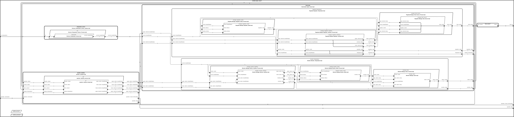

# ISOLETTE

##  Clone seL4 Branch

```
git clone --branch sel4_mods git@github.com:santoslab/isolette.git
```

## Running on JVM

```
cd isolette/isolette
sbt "runMain isolette.Demo"
```

## Running on "Linux"

* In Linux

```
cd isolette/isolette
MAKE_ARGS=-j4 bin/compile-linux.sh
bin/run-linux.sh # Press Enter twice when prompted
bin/stop.sh
```

* In macOS

```
cd isolette/isolette
MAKE_ARGS=-j4 bin/compile-macOS.sh
bin/run-macOS.sh # Press Enter twice when prompted
bin/stop.sh
```

* In Cygwin

```
cd isolette/isolette
MAKE_ARGS=-j4 bin/compile-cywin.sh
bin/run-cygwin.sh # Press Enter twice when prompted
bin/stop.sh
```

## Running on seL4/QEMU

**Prerequisite** [CAmkES bff24d24832f467344dd8ed2d7c0aeaaf1490f93](https://github.com/seL4/camkes-manifest/tree/bff24d24832f467344dd8ed2d7c0aeaaf1490f93) or newer -- see [global-endpoint](https://github.com/SEL4PROJ/global-components/commit/226664) changes

```
isolette/isolette/camkes_setup.sh
```

The path to the CAmkES installation directory can be supplied if it is not located at `/host/camkes-project`. For example,

```
isolette/isolette/camkes_setup.sh /path/to/camkes
```

## Diagrams

### AADL
  
  
### seL4_TB
  [pdf version](src/c/CAmkES_seL4/diagrams/CAmkES-arch-SeL4.pdf)
  
  
