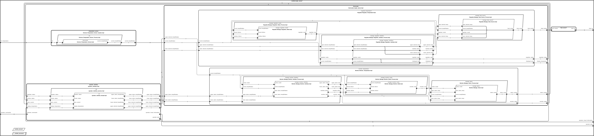
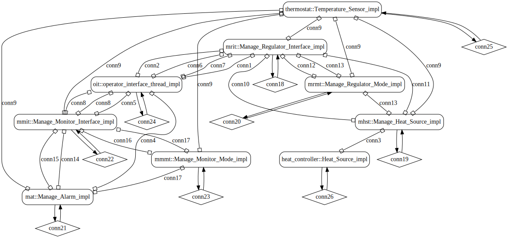
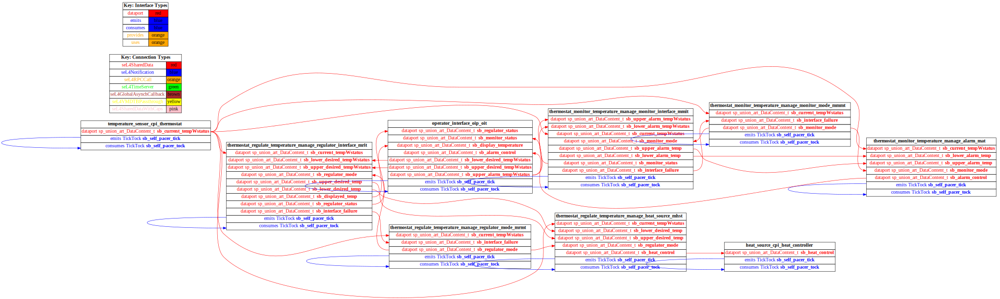

# isolette

 Table of Contents
  * [Diagrams](#diagrams)
    * [AADL Arch](#aadl-arch)
    * [SeL4](#sel4)
      * [SeL4 CAmkES Arch](#sel4-camkes-arch)
      * [SeL4 CAmkES HAMR Arch](#sel4-camkes-hamr-arch)
  * [Metrics](#metrics)
    * [AADL Metrics](#aadl-metrics)
    * [JVM Metrics](#jvm-metrics)
    * [Linux Metrics](#linux-metrics)
    * [SeL4 Metrics](#sel4-metrics)
  * [Example Output](#example-output)
    * [JVM Expected Output: Timeout = 0 seconds](#jvm-expected-output-timeout--0-seconds)
    * [SeL4 Expected Output: Timeout = 0 seconds](#sel4-expected-output-timeout--0-seconds)

## Diagrams
### AADL Arch


### SeL4
#### SeL4 CAmkES Arch


#### SeL4 CAmkES HAMR Arch


## Metrics
### AADL Metrics
| | |
|--|--|
|Threads|9|
|Ports|47|
|Connections|25|

### JVM Metrics
Total CLOC
-----------

Language|files|blank|comment|code
:-------|-------:|-------:|-------:|-------:
Scala|104|1945|1050|6349
--------|--------|--------|--------|--------
SUM:|104|1945|1050|6349

User CLOC
---------
 | | |
 |--|--:|
 |Code|509|
 |Log Code|2|

### Linux Metrics
Total CLOC
-----------

Language|files|blank|comment|code
:-------|-------:|-------:|-------:|-------:
C|264|4008|266|24797
C/C++ Header|500|4526|410|12289
C++|2|102|53|852
--------|--------|--------|--------|--------
SUM:|766|8636|729|37938

User CLOC
---------
| | |
|--|--:|
|Code|90|
|Log Code|0|

### SeL4 Metrics
Not sure what to measure here -- Camkes ADL cloc, glue-code cloc, generated seL4 code?

## Example Output
*NOTE:* actual output may differ due to issues related to thread interleaving
### JVM Expected Output: Timeout = 0 seconds

  |HAMR Codegen Configuration| |
  |--|--|
  | package-name | isolette |
  | exclude-component-impl | false |
  | bit-width | 32 |
  | max-string-size | 256 |
  | max-array-size | 1 |


  **How To Run**
  ```
  sbt run
  ```

  ```
  Didn't find 'Booting all finished'!
  ```

### SeL4 Expected Output: Timeout = 0 seconds

  |HAMR Codegen Configuration| |
  |--|--|
  | package-name | isolette |
  | exclude-component-impl | false |
  | bit-width | 32 |
  | max-string-size | 256 |
  | max-array-size | 1 |


  **How To Run**
  ```
  isolette/hamr/bin/transpile-sel4.sh
  isolette/hamr/src/c/CAmkES_seL4/bin/run-camkes.sh -s
  ```

  ```
  Didn't find 'Booting all finished'!
  ```