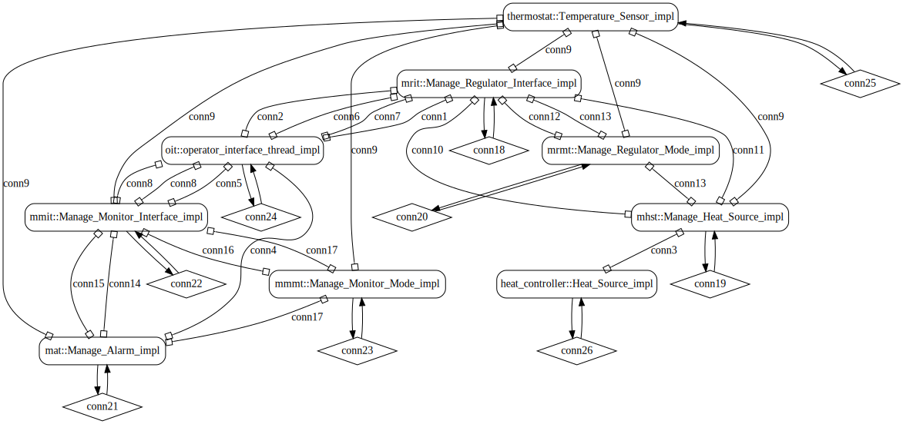
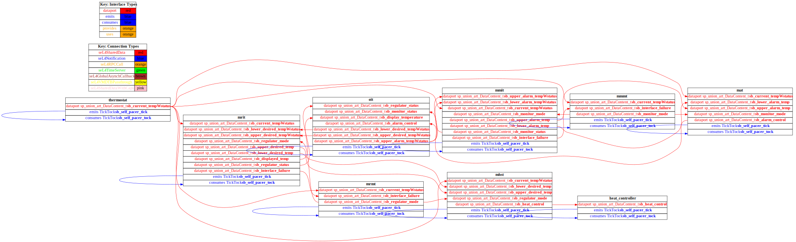

# aadl

 Table of Contents
  * [Diagrams](#diagrams)
    * [AADL Arch](#aadl-arch)
    * [SeL4](#sel4)
      * [SeL4 CAmkES Arch](#sel4-camkes-arch)
      * [SeL4 CAmkES HAMR Arch](#sel4-camkes-hamr-arch)
  * [Example Output](#example-output)
    * [SeL4 Expected Output: Timeout = 25 seconds](#sel4-expected-output-timeout--25-seconds)

## Diagrams
### AADL Arch


### SeL4
#### SeL4 CAmkES Arch


#### SeL4 CAmkES HAMR Arch


## Example Output
*NOTE:* actual output may differ due to issues related to thread interleaving
### SeL4 Expected Output: Timeout = 25 seconds

  |HAMR Codegen Configuration| |
  |--|--|
  | package-name | isolette |
  | exclude-component-impl | false |
  | bit-width | 32 |
  | max-string-size | 250 |
  | max-array-size | 1 |


  **How To Run**
  ```
  bin/transpile-sel4.sh
  src/c/CAmkES_seL4/bin/run-camkes.sh -s
  ```

  ```
  Booting all finished, dropped to user space
  Entering pre-init of Manage_Regulator_Interface_impl
  ArEntering pre-init of Manage_Heat_SourEntering pre-init of Manage_Regulator_Mode_impl
  Entering pre-init of Manage_Alarm_impl
  Entering pre-init of Manage_Monitor_Interface_impl
  Entering pre-init of Manage_Monitor_Mode_impl
  Entering pre-init of operator_interface_thread_impl
  Entering pre-init of Temperature_Sensor_impl
  Entering pre-init of Heat_Source_impl
  t: Registered component: isolette_single_sensor_Instance_thermostat_regulate_temperature_manage_regulator_interface_mrit (periodic: 1000)
  ce_impl
  Art: Registered component: isolette_single_seArt: Registered component: isolette_single_sensor_Instance_theArt:Art: Registered component: isolette_single_sensor_Instance_thermArt: Registered comArt: Registered component: isolette_single_sensor_InstancArt: Registered component: isolette_single_sensor_InstArt: - Registered port: isolette_single_sensor_Instance_thermostat_regulate_temperature_manage_regulator_interface_mrit_current_tempWstatus (data in)
  Art: - Registered port: isolette_single_sensor_Instance_thermostat_regulate_temperatuArt: Registered component: isolette_single_sensor_Instance_thermostat_regulate_temperature_manage_heat_source_mhstnsor_Instance_thermostat_regulate_temperature_manage_regulator_mode_mrmt (periodic: 1000)
  Art: - Registered port: isolette_single_sensor_Instance_thermostat_regulate_temperature_manage_regulator_mode_mrmt_current_tempWstatus (data in)
  Art: - rmostat_monitor_temperature_manage_alarm_mat (periodic: 1000)
  Art: - Registered port: isolette_single_sensor_Instance_thermostat_monitor_temperature_manage_alarm_mat_current_tempWstatus (data in)
  Art: - Registered port: isolette Registered component: isolette_single_sensor_Instance_thermostat_monitor_temperature_manage_monitor_interface_mmit (periodic: 1000)
  Art: - Registered port: isolette_single_sensor_Instance_thermostat_monitor_temperature_manage_monitor_ostat_monitor_temperature_manage_monitor_mode_mmmt (periodic: 1000)
  Art: - Registered port: isolette_single_sensor_Instance_thermostat_monitor_temperature_manage_monitor_mode_mmmt_current_tempWstatus (data in)
  Artponent: isolette_single_sensor_Instance_operator_interface_oip_oit (periodic: 1000)
  Art: - Registered port: isolette_single_sensor_Instance_operator_interface_oip_oit_regulator_status (data in)
  Art: - e_temperature_sensor_cpi_thermostat (periodic: 1000)
  Art: - Registered port: isolette_single_sensor_Instance_temperature_sensor_cpi_thermostat_air (data in)
  Art: - Registered port: isolette_single_sensor_Instance_teance_heat_source_cpi_heat_controller (periodic: 1000)
  Art: - Registered port: isolette_single_sensor_Instance_heat_source_cpi_heat_controller_heat_control (data in)
  Art: - Registered port: isolette_single_sensor_Instare_manage_regulator_interface_mrit_lower_desired_tempWstatus (data in)
  Art: - Registered port: isolette_single_sensor_Instance_thermostat_regulate_temperature_manage_regulator_interface_mrit_upper_desired_tempWstatus (data in)
  Art: - Registered port: isolette_single_sensor_Instanc (periodic: 1000)
  Art: - Registered port: isolette_single_sensor_Instance_thermostat_regulate_temperature_manage_heat_source_mhst_current_tempWstatus (data in)
  Art: - Registered port: isolette_single_sensor_Instance_thermostat_regulate_temperature_manage_heRegistered port: isolette_single_sensor_Instance_thermostat_regulate_temperature_manage_regulator_mode_mrmt_interface_failure (data in)
  Art: - Registered port: isolette_single_sensor_Instance_thermostat_regulate_temperature_manage_regulator_mode_mrmt_internal_failure (data in)
  _single_sensor_Instance_thermostat_monitor_temperature_manage_alarm_mat_lower_alarm_temp (data in)
  Art: - Registered port: isolette_single_sensor_Instance_thermostat_monitor_temperature_manage_alarm_mat_upper_alarm_temp (data in)
  Art: - Registered port: isolette_single_sensor_Iinterface_mmit_upper_alarm_tempWstatus (data in)
  Art: - Registered port: isolette_single_sensor_Instance_thermostat_monitor_temperature_manage_monitor_interface_mmit_lower_alarm_tempWstatus (data in)
  Art: - Registered port: isolette_single_sensor_Instance_thermostat_mon: - Registered port: isolette_single_sensor_Instance_thermostat_monitor_temperature_manage_monitor_mode_mmmt_interface_failure (data in)
  Art: - Registered port: isolette_single_sensor_Instance_thermostat_monitor_temperature_manage_monitor_mode_mmmt_internal_failure (data in)
  Art: - RegRegistered port: isolette_single_sensor_Instance_operator_interface_oip_oit_monitor_status (data in)
  Art: - Registered port: isolette_single_sensor_Instance_operator_interface_oip_oit_display_temperature (data in)
  Art: - Registered port: isolette_sinmperature_sensor_cpi_thermostat_current_tempWstatus (data out)
  Leaving pre-init of Temperature_Sensor_impl
  nce_heat_source_cpi_heat_controller_heat_out (data out)
  Leaving pre-init of Heat_Source_impl
  e_thermostat_regulate_temperature_manage_regulator_interface_mrit_regulator_mode (data in)
  Art: - Registered port: isolette_single_sensor_Instance_thermostat_regulate_temperature_manage_regulator_interface_mrit_upper_desired_temp (data out)at_source_mhst_lower_desired_temp (data in)
  Art: - Registered port: isolette_single_sensor_Instance_thermostat_regulate_temperature_manage_heat_source_mhst_upper_desired_temp (data in)
  Art: - Registered port: isolette_single_sensor_Instance_thermostat_regulArt: - Registered port: isolette_single_sensor_Instance_thermostat_regulate_temperature_manage_regulator_mode_mrmt_regulator_mode (data out)
  Leaving pre-init of Manage_Regulator_Mode_impl
  nstance_thermostat_monitor_temperature_manage_alarm_mat_monitor_mode (data in)
  Art: - Registered port: isolette_single_sensor_Instance_thermostat_monitor_temperature_manage_alarm_mat_alarm_control (data out)
  itor_temperature_manage_monitor_interface_mmit_current_tempWstatus (data in)
  Art: - Registered port: isolette_single_sensor_Instance_thermostat_monitor_temperature_manage_monitor_interface_mmit_monitor_mode (data in)
  Art: - Registered port: isolette_single_sensor_Instance_theistered port: isolette_single_sensor_Instance_thermostat_monitor_temperature_manage_monitor_mode_mmmt_monitor_mode (data out)
  Leaving pre-init of Manage_Monitor_Mode_impl
  gle_sensor_Instance_operator_interface_oip_oit_alarm_control (data in)
  Art: - Registered port: isolette_single_sensor_Instance_operator_interface_oip_oit_lower_desired_tempWstatus (data out)
  Art: - Registered port: isolette_single_sensor_Instance_operator_interface_oip
  Art: - Registered port: isolette_single_sensor_Instance_thermostat_regulate_temperature_manage_regulator_interface_mrit_lower_desate_temperature_manage_heat_source_mhst_regulator_mode (data in)
  Art: - Registered port: isolette_single_sensor_Instance_thermostat_regulate_temperature_manage_heatLeaving pre-init of Manage_Alarm_impl
  rmostat_monitor_temperature_manage_monitor_interface_mmit_upper_alarm_temp (data out)
  Art: - Registered port: isolette_single_sensor_Instance_thermo_oit_upper_desired_tempWstatus (data out)
  Art: - Registered port: isolette_single_sensor_Instance_operator_interface_oip_oit_lower_alarm_tempWstatus (data out)
  Art: - Registered port: isolettisolette_Devices_Temperature_Sensor_Native_getCurrentTemp called
  isolette_sired_temp (data out)
  Art: - Registered port: isolette_single_sensor_Instance_thermostat_reg_source_mhst_heat_control (data out)
  Leaving pre-init of Manage_Heat_Source_impl
  Invalid 'None' operation 'get'.
  stat_monitor_temperature_manage_monitor_interface_mmit_lower_alarm_temp (data out)
  Art: - Registered port: isolette_single_sensor_Instance_Invalid 'None' operation 'get'.
  e_single_sensor_Instance_operator_interface_oip_oit_upper_alarm_tempWstatus (data out)
  Leavingingle_sensor_Instance_temperature_sensor_cpi_thermostat: Sensed temperature: Temp_impl(59.000000)
  isolette_single_sensor_Instance_heat_source_cpi_heat_controller: Received command: Off
  ulate_temperature_manage_regulator_interface_mrit_displayed_temp (data out)
  Art: - Registered port: isolette_single_sensor_Instance_thermostat_regulate_temperature_manage_regulatorInvalid 'None' operation 'get'.
  thermostat_monitor_temperature_manage_monitor_interface_mmit_monitor_status (data out)
  Art: - Registered port: isolette_single_sensor_Instance_thermostat_monitor_temperature_manage_monitor_interface_mmit_interface_failure pre-init of operator_interface_thread_impl
  isolette_Devices_Temperature_Sensor_Native_getCurrentTemp called
  isolette_single_sensor_Instance_temperature_sensor_cpi_thermostat: Sensed temperature: Temp_impl(63.000000)
  isolette_Devices_Heat_Source_Native_setState called: Off
  _interface_mrit_regulator_status (data out)
  Art: - Registered port: isolette_single_sensor_Instance_thermostat_regulate_temperature_manage_regulator_interface_mrit_interface_failure (data out)
  Leaving (data out)
  Leaving pre-init of Manage_Monitor_Interface_impl
  isolette_Devices_Temperature_Sensor_Native_getCurrentTemp called
  isolette_single_sensor_Instance_temperature_sensor_cpi_thermostat: Sensed temperature: Temp_impl(67.000000)
   pre-init of Manage_Regulator_Interface_impl
  isolette_Isolette_UserInterface_Interface_init called 
  isolette_Isoletisolette_Devices_Temperature_Sensor_Native_getCurrentTemp called
  isolette_single_sensor_Instance_temperature_sensor_cpi_thermostat: Sensed te_UserInterface_Interface_setRegulatorStatus called: Init_Status
  isolette_Isolette_UserInterface_Interface_setMonitorStatus called: Init_Status
  temperature: Temp_impl(71.000000)
  isolette_Isolette_UserInterface_Interface_setDispayTemperature called: 98.000000
  isolette_Isolette_UserInterface_Inisolette_Devices_Temperature_Sensor_Native_getCurrentTemp called
  isolette_single_sensor_Instance_temperature_sensor_cpi_thermostat: Sensed temperature: Tterface_setAlarmControl called: Off
  isolette_Isolette_UserInterface_Interface_getLowerDesiredTempWstatus called: 97.000000
  isolette_Isolette_UserInterface_Interface_getUpperDesiredTempWstatus called: 99.000000
  isolette_Isolette_UserInteremp_impl(75.000000)
  face_Interface_getLowerAlarmTempWstatus called: 95.000000
  isolette_Isolette_UserInterface_Interface_getUpperAlarmTempWstatus called: 101.000000
  isolette_Devices_Temperature_Sensor_Native_getCurrentTemp called
  isolette_single_sensor_Instance_temperature_sensor_cpi_thermostat: Sensed temperature: Temp_impl(79.000000)
  isolette_Isolette_UserInterface_Interface_setRegulatorStatus called: Init_Status
  isolette_Isolette_UserInterface_Interface_setMonitorStatus called: Init_Status
  isolette_Isolette_UserInterface_Interface_isolette_Devices_Temperature_Sensor_Native_getCurrentTemp called
  isolette_single_sensor_Instance_temperature_sensor_cpi_thermostat: Sensed temperature: Temp_impl(83.000000)
  setDispayTemperature called: 98.000000
  isolette_Isolette_UserInterface_Interface_setAlarmControl called: Off
  isolette_Isolette_UserInterface_Interface_getLowerDesiredTempWstatus called: 97.000000
  isolette_Isolette_UserInterface_Interface_getUpperDeisolette_Devices_Temperature_Sensor_Native_getCurrentTemp called
  isolette_single_sensor_Instance_temperature_sensor_cpi_thermostat: Sensed temperature: Temp_impl(87.000000)
  siredTempWstatus called: 99.000000
  isolette_Isolette_UserInterface_Interface_getLowerAlarmTempWstatus called: 95.000000
  isolette_Isolette_UserInterface_Interface_getUpperAlarmTempWstatus called: 101.000000
  isolette_Devices_Temperature_Sensor_Native_getCurrentTemp called
  isolette_single_sensor_Instance_temperature_sensor_cpi_thermostat: Sensed temperature: Temp_impl(91.000000)
  isolette_Isolette_UserInterface_Interface_setRegulatorStatus called: Init_Status
  isolette_Isolette_UserInterface_Interface_setMonitorStatus called: Init_Status
  isolette_Isolette_UserInterface_Interface_setDispayTemperature called: 98.000000
  isolette_Isolette_UserInterface_Interface_setAlarmControl called: Off
  isolette_Isolette_UserInterface_Interface_getLowerDesiredTempWstatus called: 97.000000
  isolette_Isolette_UserInterface_Interface_getUpperDesiredTempWstatus called: 99.000000
  isolette_Isoletisolette_Devices_Temperature_Sensor_Native_getCurrentTemp called
  isolette_single_sensor_Instance_temperature_sensor_cpi_thermostat: Sensed temperature: Temp_impl(95.000000)

  ```