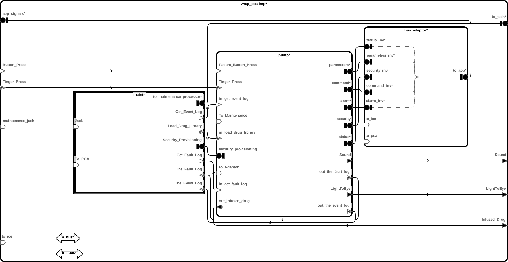

# pca-pump

 Table of Contents
  * [Diagrams](#diagrams)
    * [AADL Arch](#aadl-arch)
  * [Metrics](#metrics)
    * [AADL Metrics](#aadl-metrics)
    * [JVM Metrics](#jvm-metrics)
  * [Run Instructions](#run-instructions)
    * [JVM](#jvm)

## Diagrams
### AADL Arch


## Metrics
### AADL Metrics
| | |
|--|--|
|Threads|12|
|Ports|186|
|Connections|101|

### JVM Metrics
Directories Scanned Using [https://github.com/AlDanial/cloc](https://github.com/AlDanial/cloc) v1.88:
- [hamr/src/main](hamr/src/main)

<u><b>Total LOC</b></u>

Total number of HAMR-generated and developer-written lines of code

Language|files|blank|comment|code
:-------|-------:|-------:|-------:|-------:
Scala|140|3239|850|14223
JSON|4|0|0|179
Bourne Shell|1|11|0|40
--------|--------|--------|--------|--------
SUM:|145|3250|850|14442

<u><b>User LOC</b></u>

The number of lines of code written by the developer.
"Log" are lines of code used for logging that
likely would be excluded in a release build
 |Type|code |
 |--|--:|
 |Behavior|1220|
 |Log|146|
 |--------|--------|
 |SUM:|1366|

## Run Instructions
*NOTE:* actual output may differ due to issues related to thread interleaving
### JVM

  |HAMR Codegen Configuration| |
  |--|--|
  | package-name | pca_pump |
  | exclude-component-impl | false |
  | bit-width | 32 |
  | max-string-size | 256 |
  | max-array-size | 1 |


  **How To Run**
  ```
  cd pca-pump/hamr
  sbt run
  ```
  **Expected Output: Timeout = 0 seconds**
  ```
    Didn't find 'Booting all finished'!
  ```