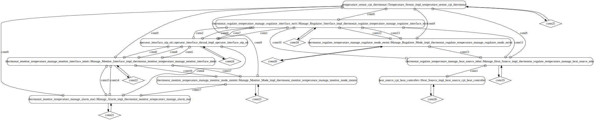

# temperature-control-ds

 Table of Contents
  * [Diagrams](#diagrams)
    * [AADL Arch](#aadl-arch)
    * [SeL4](#sel4)
      * [SeL4 CAmkES Arch](#sel4-camkes-arch)
      * [SeL4 CAmkES HAMR Arch](#sel4-camkes-hamr-arch)
  * [Example Output](#example-output)
    * [SeL4 Expected Output: Timeout = 15 seconds](#sel4-expected-output-timeout--15-seconds)

## Diagrams
### AADL Arch


### SeL4
#### SeL4 CAmkES Arch


#### SeL4 CAmkES HAMR Arch


## Example Output
*NOTE:* actual output may differ due to issues related to thread interleaving
### SeL4 Expected Output: Timeout = 15 seconds

  |HAMR Codegen Configuration| |
  |--|--|
  | package-name | b |
  | exclude-component-impl | true |
  | bit-width | 32 |
  | max-string-size | 256 |
  | max-array-size | 1 |


  **How To Run**
  ```
  temperature-control-ds/hamr/bin/transpile-sel4.sh
  temperature-control-ds/hamr/src/c/CAmkES_seL4/bin/run-camkes.sh -s
  ```

  ```
  Booting all finished, dropped to user space
  Entering pre-init of TempControl_i_tcp_tempControl
  Entering pre-init of Fan_i_fp_fan
  Art: Registered component: TempControlSystem_iArt: Registered component: TempControlSystem_i_Instance_tcp_tempControl (sporadic: 1)
  Art: - Registered port: TempControlSystem_i_Instance_tcp_tempControl_currentTemp (data in)
  Art: - Registered por_Instance_fp_fan (sporadic: 1)
  Art: - Registered port: TempControlSystem_i_Instance_fp_fan_fanCmd (event in)
  Art: - Registered port: TempControlSystem_i_Instance_fp_fan_fanAck (event out)
  Leaving pre-init of Fan_i_fp_fan
  t: TempControlSystem_i_Instance_tcp_tempControl_fanAck (event in)
  Art: - Registered port: TempControlSystem_i_Instance_tcp_tempControl_setPoint (event in)
  Art: - Registered port: TempControlSystem_i_Instance_tcp_tempControl_fanCmd (event out)
  Art: - Registered port: TempControlSystem_i_Instance_tcp_tempControl_tempChanged (event in)
  Leaving pre-init of TempControl_i_tcp_tempControl
  Entering pre-init of TempSensor_i_tsp_tempSensor
  Art: Registered component: TempControlSystem_i_Instance_tsp_tempSensor (periodic: 1000)
  Art: - Registered port: TempControlSystem_i_Instance_tsp_tempSensor_currentTemp (data out)
  Art: - Registered port: TempControlSystem_i_Instance_tsp_tempSensor_tempChanged (event out)
  Leaving pre-init of TempSensor_i_tsp_tempSensor
  TempControlSystem_i_Instance_tsp_tempSensor: Sensed: Temperature_i(84.000000, Fahrenheit)
  TempControlSystem_i_Instance_tsp_tempSensor: Sensed: Temperature_i(88.000000, Fahrenheit)
  TempControlSystem_i_Instance_tcp_tempControl: Received: Temperature_i(88.000000, Fahrenheit)
  TempControlSystem_i_Instance_tcp_tempControl: Temperature ok:
  TempControlSystem_i_Instance_tsp_tempSensor: Sensed: Temperature_i(92.000000, Fahrenheit)
  TempControlSystem_i_Instance_tcp_tempControl: Received: Temperature_i(92.000000, Fahrenheit)
  TempControlSystem_i_Instance_tcp_tempControl: Temperature ok:
  TempControlSystem_i_Instance_tsp_tempSensor: Sensed: Temperature_i(96.000000, Fahrenheit)
  TempControlSystem_i_Instance_tcp_tempControl: Received: Temperature_i(96.000000, Fahrenheit)
  TempControlSystem_i_Instance_tcp_tempControl: Temperature ok:
  TempControlSystem_i_Instance_tsp_tempSensor: Sensed: Temperature_i(100.000000, Fahrenheit)
  TempControlSystem_i_Instance_tcp_tempControl: Received: Temperature_i(100.000000, Fahrenheit)
  TempControlSystem_i_Instance_tcp_tempControl: Temperature ok:
  TempControlSystem_i_Instance_tsp_tempSensor: Sensed: Temperature_i(104.000000, Fahrenheit)
  TempControlSystem_i_Instance_tcp_tempControl: Received: Temperature_i(104.000000, Fahrenheit)
  TempControlSystem_i_Instance_tcp_tempControl: Sent fan command: On
  TempControlSystem_i_Instance_fp_fan: received fanCmd On
  TempControlSystem_i_Instance_fp_fan: Actuation result: Ok
  TempControlSystem_i_Instance_tcp_tempControl: received fanAck Ok
  TempControlSystem_i_Instance_tcp_tempControl: Actuation worked!
  TempControlSystem_i_Instance_tsp_tempSensor: Sensed: Temperature_i(100.000000, Fahrenheit)
  TempControlSystem_i_Instance_tcp_tempControl: Received: Temperature_i(100.000000, Fahrenheit)
  TempControlSystem_i_Instance_tcp_tempControl: Temperature ok:

  ```