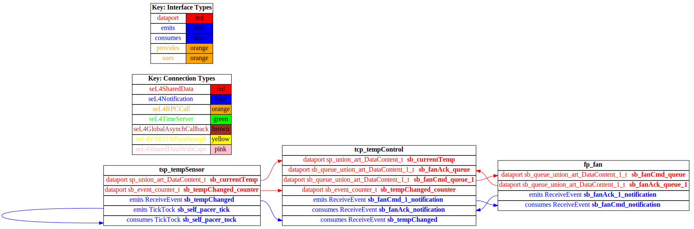

# temperature-control-ds

 Table of Contents
  * [Diagrams](#diagrams)
    * [AADL Arch](#aadl-arch)
    * [SeL4](#sel4)
      * [SeL4 CAmkES Arch](#sel4-camkes-arch)
      * [SeL4 CAmkES HAMR Arch](#sel4-camkes-hamr-arch)
  * [Metrics](#metrics)
    * [AADL Metrics](#aadl-metrics)
    * [JVM Metrics](#jvm-metrics)
    * [Linux Metrics](#linux-metrics)
    * [SeL4 Metrics](#sel4-metrics)
  * [Run Instructions](#run-instructions)
    * [JVM](#jvm)
    * [Linux](#linux)
    * [SeL4](#sel4)

## Diagrams
### AADL Arch


### SeL4
#### SeL4 CAmkES Arch


#### SeL4 CAmkES HAMR Arch


## Metrics
### AADL Metrics
| | |
|--|--|
|Threads|3|
|Ports|9|
|Connections|4|

### JVM Metrics
Directories Scanned Using [https://github.com/AlDanial/cloc](https://github.com/AlDanial/cloc) v1.88:
- [hamr-nonExcludes/src/main](hamr-nonExcludes/src/main)

<u><b>Total LOC</b></u>

Total number of HAMR-generated and developer-written lines of code

Language|files|blank|comment|code
:-------|-------:|-------:|-------:|-------:
Scala|53|788|277|2409
--------|--------|--------|--------|--------
SUM:|53|788|277|2409

<u><b>User LOC</b></u>

The number of lines of code written by the developer.
"Log" are lines of code used for logging that
likely would be excluded in a release build
 |Type|code |
 |--|--:|
 |Behavior|76|
 |Log|8|
 |--------|--------|
 |SUM:|84|

### Linux Metrics
Directories Scanned Using [https://github.com/AlDanial/cloc](https://github.com/AlDanial/cloc) v1.88:
- [hamr-nonExcludes/src/c/ext-c](hamr-nonExcludes/src/c/ext-c)
- [hamr-nonExcludes/src/c/nix](hamr-nonExcludes/src/c/nix)

<u><b>Total LOC</b></u>

Total number of HAMR-generated (transpiled) and developer-written lines of code

Language|files|blank|comment|code
:-------|-------:|-------:|-------:|-------:
C|148|1790|165|10566
C/C++ Header|284|2531|236|6857
C++|2|102|53|852
--------|--------|--------|--------|--------
SUM:|434|4423|454|18275

<u><b>User LOC</b></u>

The number of lines of code written by the developer.
The Slang-based component implementations were included by the transpiler so this represents the number of lines of C that implement Slang extensions.
"Log" are lines of code used for logging that
likely would be excluded in a release build
|Type|code |
|--|--:|
|Behavior|17|
|Log|0|
|--------|--------|
|SUM:|17|

### SeL4 Metrics
Not sure what to measure here -- Camkes ADL cloc, glue-code cloc, generated seL4 code?.  Notable is that developer had to write 0 additional LOC for the CAmkES/seL4 profile.

## Run Instructions
*NOTE:* actual output may differ due to issues related to thread interleaving
### JVM

  |HAMR Codegen Configuration| |
  |--|--|
  | package-name | b |
  | exclude-component-impl | false |
  | bit-width | 32 |
  | max-string-size | 256 |
  | max-array-size | 1 |


  **How To Run**
  ```
  cd temperature-control-ds/hamr-nonExcludes
  sbt run
  ```
  **Expected Output: Timeout = 0 seconds**
  ```
    Didn't find 'Booting all finished'!
  ```

### Linux

  |HAMR Codegen Configuration| |
  |--|--|
  | package-name | b |
  | exclude-component-impl | false |
  | bit-width | 32 |
  | max-string-size | 256 |
  | max-array-size | 1 |


  **How To Run**
  ```
  temperature-control-ds/hamr-nonExcludes/bin/transpile.sh
  temperature-control-ds/hamr-nonExcludes/bin/compile-linux.sh
  temperature-control-ds/hamr-nonExcludes/bin/run-linux.sh
  temperature-control-ds/hamr-nonExcludes/bin/stop.sh
  ```


### SeL4

  |HAMR Codegen Configuration| |
  |--|--|
  | package-name | b |
  | exclude-component-impl | false |
  | bit-width | 32 |
  | max-string-size | 256 |
  | max-array-size | 1 |


  **How To Run**
  ```
  temperature-control-ds/hamr-nonExcludes/bin/transpile-sel4.sh
  temperature-control-ds/hamr-nonExcludes/src/c/CAmkES_seL4/bin/run-camkes.sh -s
  ```
  **Expected Output: Timeout = 0 seconds**
  ```
    Didn't find 'Booting all finished'!
  ```