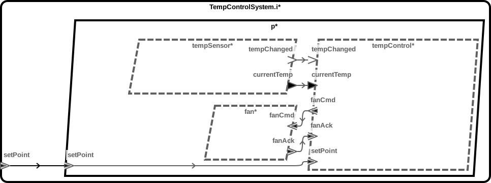
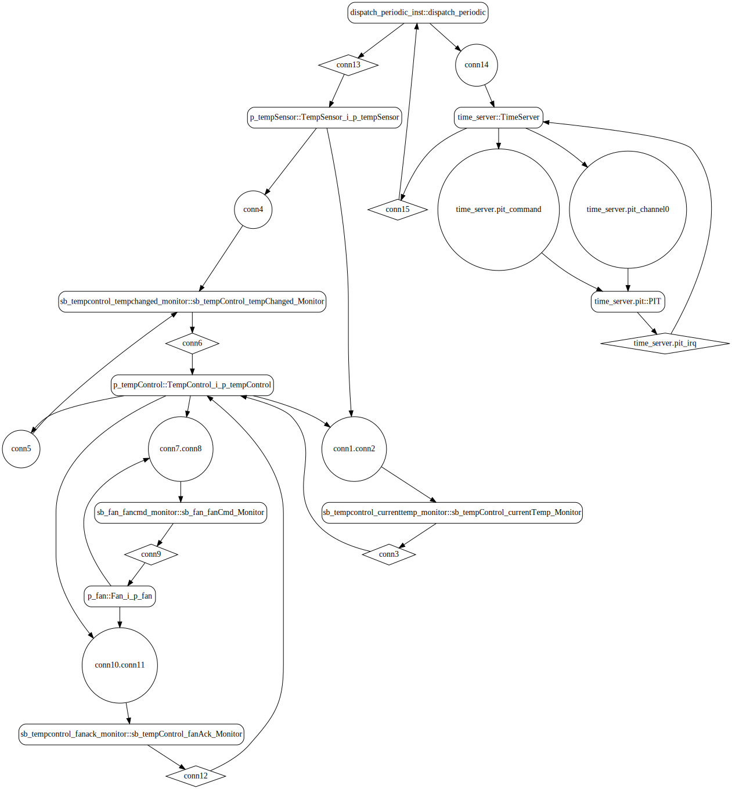
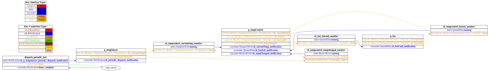
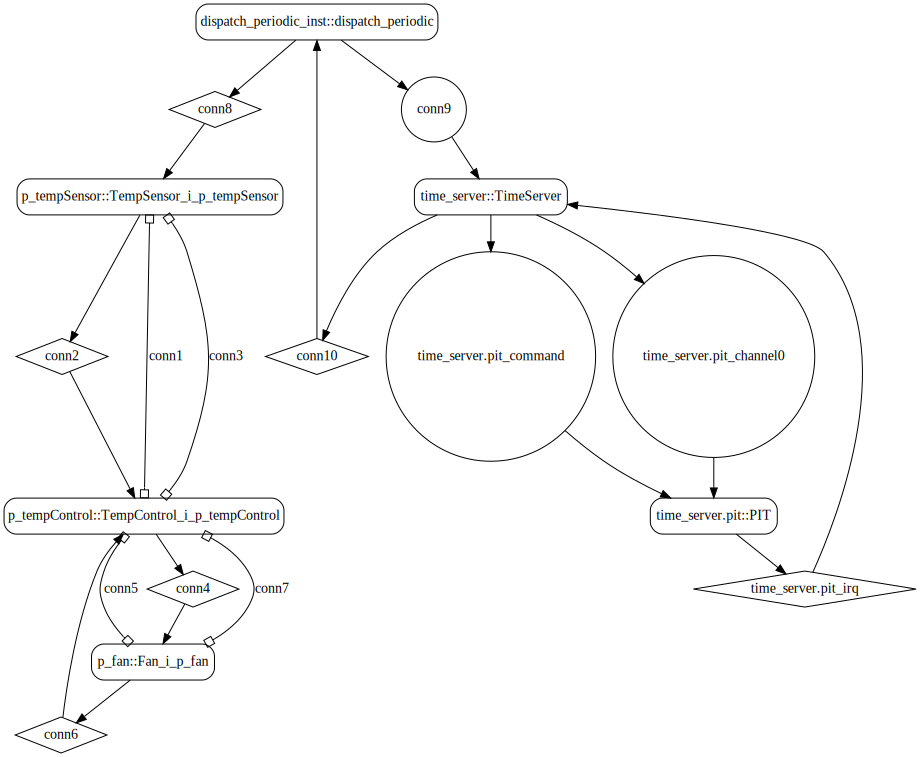
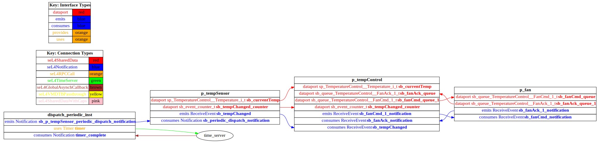

# temperature-control

 Table of Contents
  * [Diagrams](#diagrams)
    * [AADL Arch](#aadl-arch)
    * [SeL4_TB](#sel4_tb)
      * [SeL4_TB CAmkES Arch](#sel4_tb-camkes-arch)
      * [SeL4_TB CAmkES HAMR Arch](#sel4_tb-camkes-hamr-arch)
    * [SeL4_Only](#sel4_only)
      * [SeL4_Only CAmkES Arch](#sel4_only-camkes-arch)
      * [SeL4_Only CAmkES HAMR Arch](#sel4_only-camkes-hamr-arch)
  * [Metrics](#metrics)
    * [AADL Metrics](#aadl-metrics)
    * [SeL4_TB Metrics](#sel4_tb-metrics)
    * [SeL4_Only Metrics](#sel4_only-metrics)
  * [Run Instructions](#run-instructions)
    * [SeL4_TB](#sel4_tb)
    * [SeL4_Only](#sel4_only)

## Diagrams
### AADL Arch


### SeL4_TB
#### SeL4_TB CAmkES Arch


#### SeL4_TB CAmkES HAMR Arch


### SeL4_Only
#### SeL4_Only CAmkES Arch


#### SeL4_Only CAmkES HAMR Arch


## Metrics
### AADL Metrics
| | |
|--|--|
|Threads|3|
|Ports|9|
|Connections|4|

### SeL4_TB Metrics
Not sure what to measure here -- Camkes ADL cloc, glue-code cloc, generated seL4 code?.  Notable is that developer had to write 0 additional LOC for the CAmkES/seL4 profile.

### SeL4_Only Metrics
Not sure what to measure here -- Camkes ADL cloc, glue-code cloc, generated seL4 code?.  Notable is that developer had to write 0 additional LOC for the CAmkES/seL4 profile.

## Run Instructions
*NOTE:* actual output may differ due to issues related to thread interleaving
### SeL4_TB

  |HAMR Codegen Configuration| |
  |--|--|
  | package-name | b |
  | exclude-component-impl | false |
  | bit-width | 32 |
  | max-string-size | 256 |
  | max-array-size | 1 |


  **How To Run**
  ```
  temperature-control/camkes/CAkES_seL4_tb/bin/run-camkes.sh -s
  ```
  **Expected Output: Timeout = 0 seconds**
  ```
    Didn't find 'Booting all finished'!
  ```

### SeL4_Only

  |HAMR Codegen Configuration| |
  |--|--|
  | package-name | b |
  | exclude-component-impl | false |
  | bit-width | 32 |
  | max-string-size | 256 |
  | max-array-size | 1 |


  **How To Run**
  ```
  temperature-control/camkes/CAmkES_seL4_only/bin/run-camkes.sh -s
  ```
  **Expected Output: Timeout = 0 seconds**
  ```
    Didn't find 'Booting all finished'!
  ```